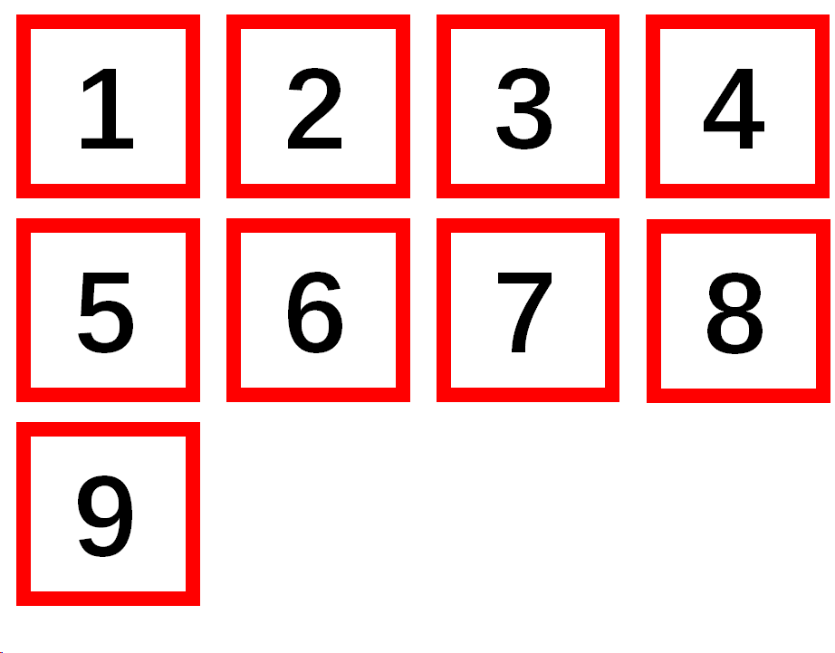

# PySimpleKeyboard
This program is a solution which uses mediapipe to replace keyboard in some specific occasions based on python.
## Features
* Lighter and easier solution of vision keyboard
* Easier to carry
* Added Key lock and media return for improving
## Installation
```commandline
python -m pip install mediapipe opencv-python pyuserinput playsound
```
Or simply by:
```commandline
python -m pip install -r requirements.txt
```
Noticing that this project supports all common platforms, so there shouldn't be any conflicts while installing.  
## Requirements
### Hardware
#### Printed Keyboard
Print a keyboard just like the keyboard.png  
  
Or simply print anything you'd like with square as keys.  
In the future we might add yolo or other detection networks, then you may need to retrain the network if you print your own keyboard.  
#### Camera
Just make sure it can be used by:
```python
import cv2
cv2.VideoCapture(-1)
```
### Software
Requiring python version >= 3.7 <=3.10 (It doesn't affect much if you are at nearing version, keeping a new version can be ok but will have probably danger).  
You can check the version by commandline below:
```commandline
python
``` 
## Usage
### Initialization
See the part of the issues known  
### Main
Run main.py by python or:  
## Customer using
Draw a "U" in the part of the square which you want to input with your finger, don't make your fingers out of the square, so you won't mis-input  
```commandline
python main.py
```
## Issues known
The threading has problem that the lock is released, so now you have to initialize the program by enable the t1 part and copy the final result and assign it as firstlist, don't forget to disable the previous firstlist.  
## Space for Improvement
Adding detection networks in the initialization function or replace preinitialize function.   
Fix the issue of threading.  
## Simple Customize
Change the .wav files in media into any .wav files you would like  
